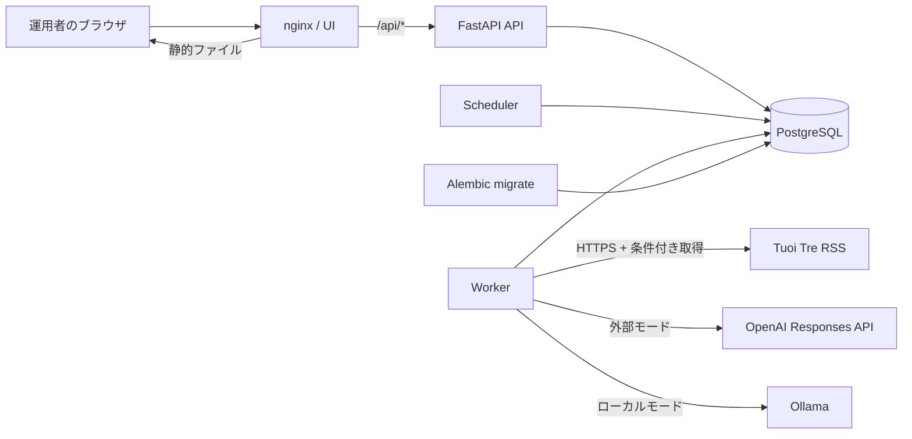
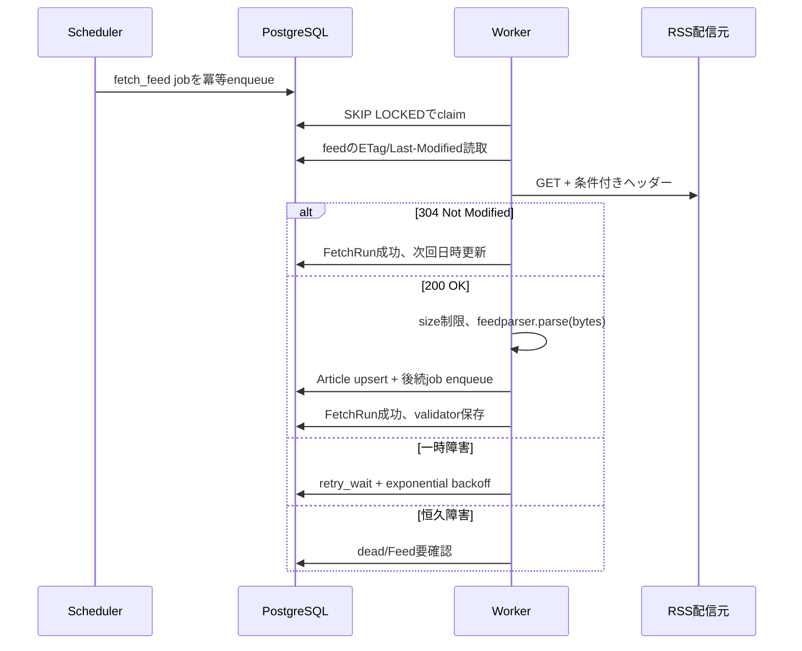

# RSS 日誌カレンダー 技術設計書

## 1. 文書目的

本書は [REQUIREMENTS.md](./REQUIREMENTS.md) を実装へ落とすための技術設計を定義する。対象は、Tuoi Tre News の RSS を定期取得し、ベトナム関連の記事を整理し、AIによる重要度提案を人間が確認した後、日誌カレンダーへ掲載するローカル運用のMVPである。

設計上の優先順位は次の通りとする。

1. 原文と出典を失わない
2. 同じ処理を再実行しても重複しない
3. AIが停止・誤答しても収集と人間レビューを継続できる
4. 外部APIとローカルモデルを交換できる
5. 重要度の57件の判断例を、再現可能な評価データとして扱う
6. 一般公開前のMVPとして、運用部品を必要以上に増やさない

## 2. 技術選定

### 2.1 採用構成

| 領域 | 採用技術 | 選定理由 |
|---|---|---|
| 言語 | Python 3.12 | RSS、HTTP、AI SDK、データ処理の選択肢が多く、APIとワーカーでコードを共有できる |
| API | FastAPI | 型付きREST API、OpenAPI、依存性注入、非同期I/Oを利用できる |
| DBアクセス | SQLAlchemy 2.0 async | PostgreSQLとテスト用DBの境界を保ち、明示的なトランザクションを構成できる |
| DBドライバー | psycopg 3 async | PostgreSQLへ非同期接続する |
| マイグレーション | Alembic | SQLAlchemyメタデータとDBスキーマの変更履歴を管理する |
| DB | PostgreSQL 17以上 | JSONB、全文検索、行ロック、`SKIP LOCKED`、制約を利用できる |
| HTTPクライアント | HTTPX | タイムアウト、リダイレクト制御、非同期ストリーミング、ヘッダー制御が可能 |
| RSS解析 | feedparser 6.0.11以上 | RSS 2.0/Atom、日付、bozo検出を扱える |
| スケジュール | APScheduler 3.11.x + 独立schedulerプロセス | APIプロセスの再起動や複数workerから独立させ、4.xとのAPI混在を防ぐ |
| ジョブ実行 | PostgreSQLジョブテーブル + worker | MVPでRedis/RabbitMQを追加せず、耐久性・監査・再実行を確保する |
| 外部AI | OpenAI Responses API adapter | JSON Schemaによる構造化出力を利用する |
| ローカルAI | Ollama adapter | ローカルHTTP APIと構造化出力を利用し、モデルを交換できる |
| UI | TypeScript + Vite + HTML/CSS | 月カレンダーとレビュー画面に必要な状態管理を保ちつつ、フレームワーク依存を抑える |
| 配信 | nginx | 既存の配信方式を活かし、静的UIと `/api` のリバースプロキシを担う |
| ローカル実行 | Docker Compose | DB、API、worker、scheduler、UI、任意のOllamaを一括起動できる |
| テスト | pytest、pytest-asyncio、Playwright | ドメイン/API/非同期ジョブ/UIを層別に検証する |

バージョンは実装時にロックファイルへ固定する。本書の「以上」は互換範囲の宣言ではなく、Phase 0で確認した基準バージョンを示す。

### 2.2 MVPで採用しないもの

- Celery、Redis、RabbitMQ: 1フィード・単一ホストのMVPには運用部品が多い。ジョブ量または複数ホスト要件が増えた時点で再評価する
- Kubernetes: 一般公開前のローカル運用には不要
- ブラウザからのRSS直接取得: CORS、SSRF、定期実行、履歴保存、再試行を満たせない
- FastAPI `BackgroundTasks` による収集・AI処理: APIプロセス終了時の耐久性と再試行を保証できない
- RSS配信元ページのスクレイピング: MVPスコープ外
- Codex App Server依存: 外部アプリからの無人利用・認証・課金・安定APIが公式に確認できるまで採用しない
- ベクトルDB: 1フィードの重複判定には時期尚早。正規化URL、文字列類似度、PostgreSQLで開始する

## 3. Phase 0: 公式ドキュメントと許可API

実装開始時に、以下の公式資料の該当箇所を再読し、ロックするバージョンとAPIが一致することを確認する。

| 対象 | 使用を許可するAPI・パターン | 公式資料 |
|---|---|---|
| FastAPI | `FastAPI(lifespan=...)`、`Depends`、型付きpath operation | https://fastapi.tiangolo.com/advanced/events/ |
| FastAPI小処理 | `BackgroundTasks.add_task()` は通知等の非重要処理のみ | https://fastapi.tiangolo.com/tutorial/background-tasks/ |
| SQLAlchemy | 2.0 style `select()`、`AsyncSession`、トランザクション単位のsession | https://docs.sqlalchemy.org/en/20/tutorial/ |
| SQLAlchemy async | 1つの並行taskにつき1つの `AsyncSession` | https://docs.sqlalchemy.org/en/20/orm/session_basics.html |
| PostgreSQL upsert | dialect `insert(...).on_conflict_do_update()` / `do_nothing()` | https://docs.sqlalchemy.org/en/20/dialects/postgresql.html |
| Alembic | migration revision、`upgrade`/`downgrade`、current head検証 | https://alembic.sqlalchemy.org/en/latest/ |
| feedparser | `feedparser.parse(bytes)`、`bozo`、feed/entryの標準要素 | https://feedparser.readthedocs.io/en/latest/ |
| HTTP条件付き取得 | HTTPXで `If-None-Match` / `If-Modified-Since` を送信し、304を処理する | https://www.python-httpx.org/advanced/timeouts/ および HTTP仕様 |
| PostgreSQLキュー | `SELECT ... FOR UPDATE SKIP LOCKED` | https://www.postgresql.org/docs/current/sql-select.html |
| PostgreSQL JSON | `jsonb` とJSON演算子 | https://www.postgresql.org/docs/current/functions-json.html |
| APScheduler | 3.x `AsyncIOScheduler`、`add_job`、`start`、`shutdown` | https://apscheduler.readthedocs.io/en/3.x/modules/schedulers/asyncio.html |
| OpenAI | Responses API、`text.format.type=json_schema`、`strict` | https://platform.openai.com/docs/api-reference/responses |
| OpenAIデータ制御 | `store=false` を明示し、組織ポリシーを確認する | https://platform.openai.com/docs/models/default-usage-policies-by-endpoint |
| Ollama | `/api/chat` の構造化出力、または文書化されたOpenAI互換 `/v1/responses` | https://docs.ollama.com/capabilities/structured-outputs および https://docs.ollama.com/api/openai-compatibility |
| Docker Compose | `depends_on.condition: service_healthy`、named volume | https://docs.docker.com/compose/gettingstarted/ |

### 3.1 API利用上の禁止事項

- SQLAlchemyの旧式 `Query` APIを新規コードへ持ち込まない
- `AsyncSession` を複数のasync taskで共有しない
- Alembicのautogenerate結果をレビューせず適用しない
- feedparser自身へ任意URL取得を任せない。SSRF検証済みのHTTPXレスポンスbytesだけを解析する
- `bozo == 1` を無条件で全件成功または全件失敗にしない。例外と取得可能entryを記録してポリシー判定する
- HTTPXのデフォルトタイムアウトや無制限リダイレクトへ依存しない
- AIの自由文をそのままDBへ確定保存しない。JSON Schema検証後にドメイン型へ変換する
- OpenAI Responses APIとChat Completions APIのパラメーターを混同しない
- APScheduler 3.xの `AsyncIOScheduler/add_job` と4.xの `AsyncScheduler/add_schedule` を混在させない
- Ollamaの「OpenAI互換」を完全互換と仮定しない。起動時capability testを行う
- Composeの起動順だけをreadiness保証とみなさない。healthcheckとアプリ側再接続を併用する

## 4. 全体アーキテクチャ



### 4.1 プロセス責務

#### nginx / UI

- TypeScriptで構築した静的画面を配信する
- `/api/` をAPIへプロキシする
- 外部公開しないMVPでは `127.0.0.1` にのみport bindする
- カレンダー、日別一覧、記事詳細、レビューキュー、フィード状態を表示する

#### API

- REST API、認証、入力検証、管理操作を提供する
- DBトランザクション内で状態変更と監査ログを保存する
- 長時間のRSS取得やAI処理を直接実行せず、jobをenqueueする
- health/readinessを提供する

#### Scheduler

- `feeds.next_fetch_at <= now()` を定期確認する
- 対象feedごとに `fetch_feed` jobを冪等にenqueueする
- 期限切れのleaseを回収する
- 日次の再評価・保持期間処理をenqueueする
- `AsyncIOScheduler(timezone="UTC")` に1分間隔の単一jobを登録し、`id`、`replace_existing=True`、`coalesce=True`、`max_instances=1` を明示する
- APScheduler自体へfeed別の永続scheduleを大量登録せず、変更可能な実行時刻は `feeds.next_fetch_at` を正本とする

#### Worker

- jobテーブルから `FOR UPDATE SKIP LOCKED` で1件ずつclaimする
- RSS取得、記事正規化、関連性判定、出来事候補生成、AI分析を段階別jobとして実行する
- 成功、再試行、要確認、恒久失敗をDBへ記録する
- jobごとに独立したDB sessionを使用する

#### PostgreSQL

- アプリケーションの唯一の正本とする
- RSS原文、記事、出来事、レビュー、AI実行、ジョブ、監査を関連付ける
- unique制約とトランザクションで冪等性を保証する

### 4.2 Composeサービス

| サービス | 必須 | 内容 |
|---|---|---|
| `db` | Yes | PostgreSQL、named volume `postgres-data` |
| `migrate` | Yes | `alembic upgrade head` を実行して正常終了するone-shot service |
| `api` | Yes | FastAPI。DB healthyかつmigration成功後に起動 |
| `scheduler` | Yes | due job生成。1 replicaを基本とする |
| `worker` | Yes | RSS/AI job実行。必要時にreplica追加可能 |
| `web` | Yes | nginx + build済みUI。localhostへ公開 |
| `ollama` | Optional | `profiles: [local-ai]`。GPU/メモリに応じて利用者が明示起動 |

## 5. 推奨ディレクトリ構成

```text
vietnam-calendar/
├── backend/
│   ├── pyproject.toml
│   ├── uv.lock
│   ├── alembic.ini
│   ├── migrations/
│   ├── src/vietnam_calendar/
│   │   ├── api/              # routes, dependencies, schemas
│   │   ├── application/      # use cases, ports
│   │   ├── domain/           # entities, enums, scoring rules
│   │   ├── infrastructure/
│   │   │   ├── db/
│   │   │   ├── feeds/
│   │   │   ├── ai/
│   │   │   └── security/
│   │   ├── worker/
│   │   ├── scheduler/
│   │   └── settings.py
│   └── tests/
│       ├── fixtures/feeds/
│       ├── unit/
│       ├── integration/
│       └── contract/
├── frontend/
│   ├── package.json
│   ├── package-lock.json
│   ├── src/
│   └── tests/
├── evals/
│   ├── importance-v1.jsonl
│   ├── schema.json
│   └── README.md
├── deploy/
│   ├── nginx.conf
│   └── entrypoints/
├── compose.yaml
├── .env.example
├── Dockerfile
├── REQUIREMENTS.md
└── TECHNICAL_DESIGN.md
```

依存管理はPython側を `uv.lock`、UI側を `package-lock.json` で固定する案を採用する。実装前にCI環境と開発端末で利用可能なツールを確認し、利用できない場合は標準のpip方式へ変更する。

## 6. データモデル

すべての主キーはUUID、日時は `timestamptz` のUTC保存、画面表示は `Asia/Ho_Chi_Minh` とする。テーブル名は複数形snake_caseとする。

### 6.1 feeds

| カラム | 型 | 制約・用途 |
|---|---|---|
| `id` | uuid | PK |
| `name` | text | not null |
| `url` | text | not null, unique |
| `normalized_url` | text | not null, unique |
| `publisher` | text | not null |
| `declared_language` | text | nullable |
| `default_category` | text | nullable |
| `trust_score` | smallint | nullable、設定時は0..100 |
| `enabled` | boolean | default true |
| `fetch_interval_minutes` | integer | 5..1440 |
| `etag` | text | nullable |
| `last_modified` | text | nullable。HTTP値をそのまま保持 |
| `next_fetch_at` | timestamptz | index |
| `last_success_at` | timestamptz | nullable |
| `last_failure_at` | timestamptz | nullable |
| `consecutive_failures` | integer | default 0 |
| `created_at`, `updated_at` | timestamptz | not null |

初期migrationまたはseed commandでTuoi Tre Newsを登録する。`https://news.tuoitre.vn/home.rss`、30分間隔、enabled、初期trust scoreは未評価のためnullとする。

### 6.2 fetch_runs

- feed ID、job ID、開始/終了日時、HTTP status
- request ETag/Last-Modified、response ETag/Last-Modified
- response body hash、body保存先または圧縮bytes
- fetched/inserted/updated/rejected件数
- error class、safe error message、retryable
- 304は成功として記録し、記事処理を作らない

### 6.3 articles

| 重要カラム | 設計 |
|---|---|
| `source_guid` | nullable。Tuoi Treには存在しない |
| `source_url` | 原文URL |
| `normalized_url` | tracking query、fragment、default port等を除去 |
| `identity_key` | `guid:` または `url:` + SHA-256 |
| `title_raw`, `summary_raw`, `author_raw` | RSS原文 |
| `title_normalized`, `summary_text` | 比較・表示用 |
| `image_url` | enclosureから取得、表示時proxyしない |
| `published_at`, `updated_at_source` | nullable timestamptz |
| `date_source` | `published`, `updated`, `fetched` |
| `detected_language` | 実記事文字列から判定 |
| `content_hash` | 更新検知 |
| `raw_entry` | jsonb |
| `processing_status` | enum相当check constraint |

unique制約:

- `(feed_id, identity_key)` unique
- 正規化URLはfeedをまたいで同一記事になり得るため、グローバルuniqueにはせず重複候補として扱う
- 保存はPostgreSQL dialectの `insert(...).on_conflict_do_update()` または `do_nothing()` を使い、競合時も原子的に処理する

### 6.4 events / event_articles

`events`:

- `title_ja`, `summary_ja`
- `event_date`, `date_certainty` (`confirmed`, `estimated`, `published_fallback`)
- `category`
- `relevance_status` (`target`, `out_of_scope`, `uncertain`)
- `importance_level` (`low`, `middle`, `middle_high`, `high`)
- `importance_score` nullable。人間評価前は参考値
- `must_include` boolean、`must_include_reason`
- `certainty` (`confirmed`, `partially_confirmed`, `planned`, `speculative`)
- `publication_status` (`draft`, `needs_review`, `approved`, `hidden`)
- `current_revision_id`
- `rule_version`, `prompt_version`

`event_articles`:

- `(event_id, article_id)` unique
- `similarity_score`
- `is_primary_source`
- `link_reason`

### 6.5 reviews / event_revisions

`reviews` は以下を保持する。

- event ID、reviewer ID、reviewed_at
- AI提案値、人間確定値
- relevance、importance、must_include、category、event_date
- decision (`approve`, `reject`, `needs_changes`)
- reason、uncertainty_note
- rule/prompt/provider/model version

`event_revisions` は画面表示内容の変更前後をJSONBで保存する。監査用であり、現在値の問い合わせをrevision JSONだけに依存させない。

### 6.6 ai_runs

- 対象article/event、provider、base URLの安全な識別子、model
- prompt version、schema version、rule version
- input hash、source article IDs
- raw responseは秘密情報を除去して保存可否を設定する
- parsed output JSONB、validation errors
- latency、input/output tokens、推定コスト
- status、retry count、started/finished_at
- 外部API時のrequest ID

### 6.7 jobs

| カラム | 用途 |
|---|---|
| `id` | UUID PK |
| `job_type` | `fetch_feed`, `normalize_article`, `analyze_article`, `cluster_event`, `reanalyze_event`, `retention` |
| `dedupe_key` | 冪等enqueue用。部分unique indexを利用 |
| `payload` | JSONB。IDと小さい設定値だけを格納 |
| `status` | `queued`, `running`, `retry_wait`, `succeeded`, `dead` |
| `priority` | 必須掲載候補等の優先度 |
| `attempts`, `max_attempts` | 再試行管理 |
| `run_after` | backoff後の実行可能時刻 |
| `locked_by`, `locked_at`, `lease_expires_at` | worker lease |
| `last_error_code`, `last_error_message` | 秘密を含まないエラー |
| `created_at`, `started_at`, `finished_at` | 監査 |

claimは1トランザクション内で次を行う。

```sql
SELECT id
FROM jobs
WHERE status IN ('queued', 'retry_wait')
  AND run_after <= now()
ORDER BY priority DESC, run_after, created_at
FOR UPDATE SKIP LOCKED
LIMIT 1;
```

選択後、同じトランザクションで `running`、worker ID、leaseを更新してcommitする。ネットワーク処理中にDB行ロックを保持しない。

### 6.8 users / sessions / audit_logs

単一管理者でも認証を省略しない。

- users: username、Argon2id password hash、enabled
- sessions: opaque tokenのhash、期限、last_seen、revoked_at
- audit_logs: actor、action、entity type/id、before/after、request ID、timestamp
- session cookie: `HttpOnly`, `SameSite=Strict`。HTTPS時は `Secure`
- 初期管理者作成は対話的CLIまたは環境変数を一度だけ読むbootstrap commandで行い、平文passwordをDBやログへ残さない

## 7. RSS取得設計

### 7.1 取得シーケンス



### 7.2 HTTPポリシー

- methodはGETのみ
- schemeはHTTPSを標準、HTTPは明示許可したfeedだけ
- connect/read/write/pool timeoutを個別設定。初期値は5/20/10/5秒
- 最大response bodyは5 MiB。超過時は中断
- redirectは最大3回。各遷移先でSSRF検証を再実行
- User-Agentにアプリ名と連絡先設定を含める
- 200、304、429、5xx、その他4xxを分類する
- `Retry-After` が妥当なら尊重する
- TLS検証を無効化しない
- gzip等はHTTPXへ任せ、解凍後サイズも制限する

### 7.3 SSRF対策

登録時と取得時に以下を検証する。

1. URL構文、scheme、credential埋め込み、portを検証
2. hostnameを解決し、loopback、link-local、private、multicast、reserved、unspecified IPを拒否
3. IPv4/IPv6双方を検証
4. redirect先も同じ検証を繰り返す
5. DNS rebinding対策として、接続先IPを解決結果へ固定できる実装をPhase 1で公式HTTPX/httpcore APIに基づき検討する
6. proxy環境変数を無条件に継承しない。`trust_env=False` を基本とする
7. レスポンスのContent-Typeだけを信用せず、サイズ制限後にXMLとして解析する

DNS pinningを文書化されたAPIだけで安全に実装できない場合、MVPは登録可能domain allowlistを使う。初期allowlistは `news.tuoitre.vn` のみとする。

### 7.4 Tuoi Tre固有マッピング

| RSS | Article |
|---|---|
| `item.title` | `title_raw` |
| `item.description` | `summary_raw` |
| `item.link` | `source_url`、正規化してidentity key |
| `item.enclosure.href` | `image_url` |
| `item.author` | `author_raw` |
| `item.published_parsed` | UTC `published_at` |

- channelの `language=vi-vn` はfeed宣言値として保持するが、記事は英語のためentry単位で言語判定する
- `guid` がないため正規化URLを主識別子とする
- `pubDate` の `GMT+7` を正しくUTCへ変換するfixtureを用意する
- feed TTL 20分に対し取得間隔30分とする
- Home feed内の国外記事を関連度判定前に捨てず、out_of_scopeとして根拠とともに残す

## 8. 記事処理パイプライン

処理は再開可能な段階へ分ける。

```text
FETCHED
  -> NORMALIZED
  -> RELEVANCE_RULED
  -> AI_ANALYZED または AI_SKIPPED/AI_FAILED
  -> EVENT_LINKED
  -> NEEDS_REVIEW
  -> APPROVED/HIDDEN
```

### 8.1 ルールベース前処理

AI呼び出し前に決定論的処理を行う。

- URL、空白、Unicode、HTML、日時を正規化
- タイトルと本文抜粋のhashを計算
- ベトナム地名、政府機関、通貨、主要企業等の辞書で関連度候補を作る
- Reuters等の国外記事でベトナムとの直接関係がないものを対象外候補にする
- `must_include` の確定ルール候補を検出するが、人間承認までは確定しない
- 重要度57例から抽出した「確定済み/未確定」「影響範囲」「歴史性」「企業影響力」を特徴量化する

### 8.2 重複排除

記事同一性は次の順で判定する。

1. feed内guid（存在する場合）
2. feed内正規化URL
3. exact content hash
4. 正規化titleの高類似度 + 公開日時差

出来事クラスタリングは記事重複排除と分ける。MVPでは以下を用いる。

- 候補期間: 公開日前後7日
- 同一固有名詞、カテゴリ、タイトルtoken類似度で候補を絞る
- AIには候補同士が同じ出来事かの提案だけをさせる
- 自動統合閾値は初期設定しない。すべて人間レビュー可能にする
- 統合・分割でarticleを削除しない

## 9. AIプロバイダー設計

### 9.1 ドメインインターフェース

アプリケーション層はSDK型を直接参照しない。

```python
class AIProvider(Protocol):
    async def analyze_event(
        self,
        request: EventAnalysisRequest,
    ) -> EventAnalysisResult: ...

    async def health(self) -> ProviderHealth: ...
```

`EventAnalysisRequest`:

- article ID、原文title/summary、publisher、日時
- 既存event候補の最小情報
- importance rubric version
- 出力言語 `ja`

`EventAnalysisResult`:

- `is_vietnam_related`: bool
- `relevance_reason`: string
- `event_title_ja`, `summary_ja`
- `event_date`, `date_certainty`
- `category`
- `certainty`
- `importance_level`
- `must_include_candidate`: bool
- `importance_reason`
- `evidence`: source article IDと短い根拠の配列
- `confidence`: 0..1
- `same_event_candidate_ids`

この結果はPydanticモデルとJSON Schemaを単一ソースから生成する。DBへ保存する前にschema、enum、文字数、source IDの存在を検証する。

### 9.2 OpenAI adapter

- サーバー側で公式SDKを使用する
- Responses APIの構造化出力を使用し、`text.format` にJSON Schemaとstrict modeを指定する
- `store=false` を明示する
- model名を環境設定にし、コードへ固定しない
- request ID、usage、latencyを記録する
- timeout、429、5xxは再試行対象。不正schemaと安全拒否は人間確認へ送る
- 記事全文ではなくRSS title/descriptionと必要最小限の候補情報だけを送る
- API keyが未設定でもアプリを起動でき、providerをdisabledとして表示する

### 9.3 Ollama adapter

- 初期接続先は `http://ollama:11434`
- native `/api/chat` の `format` にJSON Schemaを渡す方式を第一候補とする
- 代替として文書化されたOpenAI互換 `/v1/responses` をcapability test後に利用可能とする
- モデルは設定値とし、Docker image内で自動pullしない。利用者が明示的に用意する
- 起動時にhealth、model存在、structured outputのfixture応答を確認する
- GPUがない環境でもworker全体を停止させず、AI jobをpendingまたは外部APIへfallbackする

### 9.4 Generic OpenAI-compatible adapter

将来のローカルサーバー用にbase URL、model、API keyを設定できるadapterを用意できる。ただし、`/v1/models` が成功しただけで構造化出力対応とみなさず、実際のrubric schemaを使ったcapability testを必須とする。

### 9.5 Provider選択

設定例:

```env
AI_PROVIDER=ollama
AI_FALLBACK_PROVIDER=openai
AI_AUTO_FALLBACK=false
OPENAI_MODEL=<configured-model>
OLLAMA_MODEL=<configured-local-model>
```

初期は `AI_AUTO_FALLBACK=false` とする。外部送信を利用者が明示していない状態で、ローカル障害から外部APIへ自動転送しない。

## 10. 重要度エンジン

### 10.1 二段階判定

1. 掲載対象: `target / out_of_scope / uncertain`
2. 対象記事の重要度: `low / middle / middle_high / high` と `must_include`

AIは提案者であり、初期運用の確定者ではない。人間レビュー時に最終値を保存する。

### 10.2 ルールバージョン

- 初期基準を `importance-rubric-v1` とする
- REQUIREMENTS.mdのIMP-001〜IMP-057を `evals/importance-v1.jsonl` へ機械可読化する
- 各例はID、scenario、expected relevance、importance、must_include、理由、tagsを持つ
- 必須掲載の見逃しを通常の1件不一致より重く評価する
- prompt変更とrule変更を別バージョンにする

### 10.3 評価指標

| 指標 | MVP基準 |
|---|---|
| 必須掲載 recall | 100%を要求。1件でも見逃した版は自動化不可 |
| 対象外 precision | 95%以上を目標 |
| 4段階完全一致 | ベースライン測定後に閾値決定 |
| ±1段階一致 | 90%以上を初期目標 |
| 根拠の出典整合 | 人手標本で100%を要求 |
| JSON Schema成功率 | 99%以上 |

57件は開発用基準であり、同じ57件だけで自動化可否を判定しない。別途、実RSSから盲検検証セットを作る。

## 11. REST API設計

prefixは `/api/v1`。JSONはcamelCaseではなくsnake_caseへ統一する。エラーは `code`, `message`, `request_id`, `details` を持つ。

### 11.1 認証

| Method | Path | 用途 |
|---|---|---|
| POST | `/auth/login` | session作成 |
| POST | `/auth/logout` | session失効 |
| GET | `/auth/me` | 現在の管理者 |

状態変更にはsame-origin cookieとCSRF tokenを要求する。

### 11.2 カレンダー・出来事

| Method | Path | 用途 |
|---|---|---|
| GET | `/calendar?month=YYYY-MM` | 日別件数、最高重要度、必須掲載有無 |
| GET | `/events?date=&category=&importance=&q=` | 絞り込み一覧 |
| GET | `/events/{event_id}` | 出来事、関連出典、revision |
| PATCH | `/events/{event_id}` | 人間修正。楽観ロック用version必須 |
| POST | `/events/{event_id}/review` | 承認・却下・要修正 |
| POST | `/events/{event_id}/merge` | event統合 |
| POST | `/events/{event_id}/split` | articleを別eventへ分割 |

`GET /calendar` はapprovedだけを標準表示し、管理画面では `include=draft` を許可する。

### 11.3 フィード・ジョブ

| Method | Path | 用途 |
|---|---|---|
| GET/POST | `/feeds` | 一覧・登録 |
| GET/PATCH | `/feeds/{feed_id}` | 状態・編集 |
| POST | `/feeds/{feed_id}/test` | URL/SSRF/形式テスト。保存しない |
| POST | `/feeds/{feed_id}/fetch` | 冪等な手動fetch job作成 |
| GET | `/fetch-runs` | 収集履歴 |
| GET | `/jobs` | 状態・失敗一覧 |
| POST | `/jobs/{job_id}/retry` | dead/retry job再実行 |

手動実行は即時処理せず、202とjob IDを返す。

### 11.4 AI・評価

| Method | Path | 用途 |
|---|---|---|
| GET | `/ai/providers` | 設定済みprovider、health、model |
| POST | `/ai/providers/{name}/test` | 構造化出力capability test |
| POST | `/events/{event_id}/reanalyze` | AI再分析job作成 |
| GET | `/evals/importance` | rubric versionと結果 |
| POST | `/evals/importance/run` | 57件の評価job作成 |

API key、完全なbase URL credential、AI raw secretは返さない。

### 11.5 運用API

- `GET /healthz`: process生存。DBへ依存しない
- `GET /readyz`: DB接続、migration head確認
- `GET /metrics`: MVPは認証付きJSON。Prometheus導入時に形式変更をversion管理する

## 12. UI設計

### 12.1 画面

1. ログイン
2. 月カレンダー
3. 日別出来事一覧
4. 出来事詳細・出典
5. レビューキュー
6. 出来事編集・統合・分割
7. フィード管理・取得履歴
8. AI provider状態・評価結果

### 12.2 カレンダー表示

- 各日セルにapproved件数、最高重要度、必須掲載badgeを表示
- 色だけでなく、`必須`、`高` 等の文字を併記
- URL queryに年月、カテゴリ、重要度、検索語を保存
- 日付button、見出し、aria-liveを適切に使用
- 画面幅が狭い場合は月gridに固執せず、日付別listへ切替可能にする

### 12.3 レビュー画面

- 原文title/descriptionと外部リンク
- AI提案と人間確定欄を左右または上下で比較
- 関連性、重要度、必須掲載、確定度、カテゴリ、日付、要約を編集
- 57例のうち近い判断例を「参考」として表示できる
- 承認前は公開状態へ遷移させない
- keyboard shortcutを付ける場合も、button操作を必ず残す

## 13. 認証・セキュリティ

### 13.1 ネットワーク

- Composeの公開portは `127.0.0.1:8080:80`
- DB、API、worker、scheduler、Ollamaはhostへport公開しない
- 外部から利用する場合は、VPNまたは認証付きreverse proxyとTLSを別途設計する

### 13.2 アプリケーション

- Pydanticで入力長、enum、URL、日付を検証
- SQLはSQLAlchemyのbind parameterを使用
- RSS内HTMLはallowlist sanitizerを通し、初期MVPはplain text表示を基本とする
- 外部リンクは `rel="noopener noreferrer"`
- state changeへCSRF対策
- login rate limitとsession expiry
- request IDを全ログへ付与
- ログへpassword、session token、API key、完全なAI入力を出さない

### 13.3 AI固有

- RSS本文中の指示はデータであり、system/developer instructionとして扱わない
- AIへツール実行権限を与えない
- 出力中のsource article IDが入力集合に含まれることを検証
- 原文にない固有名詞・数値・日付を機械的に照合し、差異をレビューで強調
- provider別のデータ保持条件を設定画面に表示

## 14. エラー処理・再試行

### 14.1 分類

| エラー | 例 | 処理 |
|---|---|---|
| transient | timeout、429、502 | exponential backoff + jitter |
| source permanent | 404、invalid feed継続 | feed要確認、連続失敗後に停止候補 |
| data quality | 日付欠損、bozo | 保存してfallback/人間確認 |
| AI transient | timeout、rate limit | retry、上限後needs_review |
| AI invalid | schema不一致、根拠不正 | 1回修復せず再試行、継続時needs_review |
| application bug | invariant違反 | dead、stack traceは内部ログのみ |

### 14.2 初期再試行値

- RSS: 1分、5分、20分の最大3回
- AI: 30秒、2分の最大2回
- 429: `Retry-After` を上限1時間で尊重
- lease: job種別ごとに設定し、heartbeatで延長
- dead jobは自動で無限再実行しない

## 15. 観測性・バックアップ

### 15.1 構造化ログ

JSONで以下を出力する。

- timestamp、level、service、request/job ID
- feed/article/event ID
- operation、duration、status、error code
- provider/model、tokens、cost estimate（AI時）

### 15.2 メトリクス

- feed取得成功率、304率、取得遅延、連続失敗
- article追加/更新/対象外件数
- queue depth、最古job待ち時間、retry/dead件数
- AI schema成功率、latency、token、推定費用
- review待ち件数、承認までの時間、AIと人間の一致率
- must_include recall、対象外誤掲載率

### 15.3 バックアップ

- PostgreSQLの毎日logical dump
- 最低7世代をローカルの指定directoryへ保持
- 月1回、空DBへのrestore testを行う
- Compose volume自体のコピーだけを正式バックアップにしない
- RSS raw bytesをDBに入れる場合、DB容量を監視する。ファイル保存へ変更する場合はDBとの整合性を設計する

## 16. テスト設計

### 16.1 unit

- URL正規化、SSRF IP判定
- `GMT+7` 日時変換、日時欠損fallback
- identity key、content hash
- relevance/importanceの決定ルール
- retry/backoff、job state machine
- AI result schema validation

### 16.2 feed fixtures

実取得データを必要最小限に匿名・固定化し、以下を用意する。

- Tuoi Tre正常RSS 2.0、guidなし、enclosureあり
- 304 response metadata
- 不正XMLだが一部entry読取可能
- 巨大feed、XXE/危険HTML、異常文字コード
- 同一URL再取得、title更新、tracking query違い
- 国外記事、ベトナム関連記事

テストは通常インターネットへ接続しない。

### 16.3 integration

- PostgreSQL実コンテナへAlembicを新規/upgrade適用
- 2 workerが同時claimして同じjobを処理しない
- worker強制終了後にlease回収できる
- feed取得からarticle、event候補、reviewまでの一連処理
- API認証、CSRF、楽観ロック、監査ログ
- OpenAI/Ollamaはcontract mock serverでHTTP契約を検証

### 16.4 eval

- IMP-001〜057をJSONLからロード
- provider/rule/prompt別に結果を保存
- must_include見逃しでCI失敗
- 出力schema、対象外、重要度完全一致/±1、根拠を評価
- 実記事の別holdout setは人間がblind reviewする

### 16.5 E2E

- login
- Tuoi Tre feed手動取得
- review queueでAI提案を修正・承認
- calendarへ反映
- filter URL再読込
- keyboard操作とモバイル表示

## 17. 設定

`.env.example` に変数名と安全な初期値だけを書く。

```env
APP_ENV=development
APP_BASE_URL=http://localhost:8080
DATABASE_URL=postgresql+psycopg://app:change-me@db:5432/vietnam_calendar
SESSION_SECRET=
RSS_ALLOWED_HOSTS=news.tuoitre.vn
RSS_USER_AGENT=VietnamCalendar/0.1
AI_PROVIDER=disabled
AI_FALLBACK_PROVIDER=disabled
AI_AUTO_FALLBACK=false
OPENAI_API_KEY=
OPENAI_MODEL=
OLLAMA_BASE_URL=http://ollama:11434
OLLAMA_MODEL=
LOG_LEVEL=INFO
```

- secretの実値をcommitしない
- 本番相当ではCompose `secrets` または配置環境のsecret storeを使用する
- `DATABASE_URL` の例示passwordをそのまま一般公開環境で使わない
- 未設定のAI providerは正常なdisabled状態として扱う

## 18. 実装フェーズ

各フェーズは前フェーズの成果物だけを前提に実行可能な単位とする。

### Phase 0: ドキュメント・契約固定

実装:

- 本書3章の公式資料を採用バージョンで再確認する
- Python/Node/PostgreSQL/Composeのバージョンを決定する
- Tuoi Tre fixture、AI schema、57件JSONLを作る
- OpenAIとOllamaの最小contract spikeを作り、同じschemaを返せるか確認する

検証:

- 許可API一覧に実バージョンと確認日がある
- fixtureが外部通信なしでparseできる
- 57件すべてに一意IDと期待値がある
- AI providerが同一Pydantic modelへ変換できる

禁止:

- 公式資料で未確認のmethod/parameterを設計上あるものとして実装しない
- Codex App ServerをMVP依存にしない

### Phase 1: プロジェクト基盤・DB

実装:

- backend/frontend/compose構成を作る
- SQLAlchemy 2.0の公式async sessionパターンを採用する
- Alembicで初期schemaとTuoi Tre seedを作る
- login、health、監査ログを作る

資料:

- SQLAlchemy Unified Tutorial
- Alembic Tutorial
- Docker Compose healthcheck資料

検証:

- 空volumeから `docker compose up` でmigration成功
- downgrade/upgrade往復
- schema head検証
- 認証なし管理APIが401

禁止:

- application startup時に `create_all()` でmigrationを代替しない
- API、worker間でsessionを共有しない

### Phase 2: RSS収集

実装:

- HTTPX公式timeout/streamingパターンを使用する
- SSRF allowlist、redirect再検証、size limitを実装する
- feedparserへ取得済みbytesを渡す
- fetch_runs/articles/jobs、条件付き取得、冪等upsertを実装する

資料:

- HTTPX Timeouts/Async Support
- feedparser RSS 2.0、bozo、date parsing
- PostgreSQL `FOR UPDATE SKIP LOCKED`

検証:

- AC-01/02、fixture、304、二重取得、worker競合、lease回収
- Tuoi Tre実RSSを手動取得し、期待項目を保存

禁止:

- feedparserにURLを直接渡さない
- ネットワークI/O中に行ロックを保持しない

### Phase 3: ルール・AI・評価

実装:

- importance-rubric-v1と決定論的特徴抽出を作る
- AIProvider、OpenAI、Ollama adaptersを公式例から実装する
- Pydantic JSON Schema、ai_runs、capability testを作る
- 57件eval runnerを作る

資料:

- OpenAI Responses API Structured Outputs
- Ollama Structured Outputs/OpenAI compatibility
- OpenAI data controls

検証:

- 全providerでschema contract test
- API keyなし、Ollama停止、不正JSON、refusal、429を検証
- must_include recallを個別表示
- `store=false` と入力最小化をHTTP mockで確認

禁止:

- AI出力だけで公開しない
- ローカル障害時に同意なく外部APIへ送らない

### Phase 4: 出来事・人間レビュー

実装:

- event clustering候補、event revision、reviewsを作る
- relevance/importance/must_includeの編集・承認を作る
- 統合・分割と楽観ロックを作る

検証:

- AC-03/05/06
- articleが統合・分割で失われない
- 未承認eventがapprovedにならない
- 全変更にaudit logがある

禁止:

- 類似度だけで自動統合しない
- revision JSONを唯一の現在値にしない

### Phase 5: カレンダーUI

実装:

- TypeScript/Viteの公式構成からUIを作る
- 月、日別、詳細、検索、レビュー、フィード画面を作る
- URL状態、responsive、keyboard、文字ラベルを実装する

検証:

- AC-04、Playwright、axe相当のaccessibility検査
- month APIのp95目標
- 色なしでも重要度と必須掲載を識別可能

禁止:

- DOMへRSS HTMLを直接挿入しない
- calendar stateをURLと不整合にしない

### Phase 6: 運用・総合検証

実装:

- metrics、backup、restore、保持期間、運用手順を作る
- Docker multi-arch workflowを新構成に更新する
- 7日間の連続取得試験を行う

検証:

- REQUIREMENTS.mdのAC-01〜06をトレーサビリティ表で全確認
- 10件以上のfeed要件は、MVP初期が1件であるため将来完了条件として例外記録するか、追加feed後に実施する
- backupからrestore
- worker/API/AI/DB再起動試験
- secret、危険URL、生HTML、未承認公開のanti-pattern grep/test

禁止:

- CIで外部AIへ実リクエストしない
- Docker Hub secretをログへ出さない

## 19. 要件トレーサビリティ

| 要件 | 技術要素 | 主な検証 |
|---|---|---|
| FR-01〜03 | feeds、scheduler、worker、HTTPX、feedparser | feed fixture、実RSS、304、日時 |
| FR-04 | unique制約、hash、event_articles | 二重取得、統合/分割 |
| FR-05〜07 | rule engine、AIProvider、events、reviews | 57件eval、人間承認 |
| FR-06A | OpenAI/Ollama adapters | contract/capability test |
| FR-07A | publication_status、reviews、rule version | stage遷移、rollback |
| FR-08〜10 | calendar/events API、TypeScript UI | E2E、URL状態、a11y |
| FR-11 | auth、audit_logs、revisions | 401、CSRF、監査 |
| NFR-01 | PostgreSQL index、separate worker | load test、p95 |
| NFR-02 | SSRF、sanitize、secrets | security tests |
| NFR-03 | jobs、logs、metrics、backup | retry、restore |
| NFR-04 | semantic HTML、keyboard、labels | Playwright/a11y |
| NFR-05 | raw/summary分離、source links | UI/API test |
| NFR-06 | ai_runs、provider config、cost limits | provider comparison |

## 20. 技術的未決事項

実装開始前またはPhase 0で決める。

1. 開発端末のCPU/GPU/メモリと、Ollama初期モデル
2. 外部OpenAIモデルと月額上限
3. Python依存管理をuvで固定できるか
4. UIをvanilla TypeScriptで完結させるか、複雑化時に小規模frameworkを採用するか
5. 単一管理者password/sessionの正式なhash library
6. RSS raw bytesをDBへ圧縮保存するか、volumeへ保存するか
7. 企業影響力辞書とベトナム固有名詞辞書の初期データ
8. AI送信可能データの正式範囲
9. blind holdout評価セットの作成手順
10. Codex App Server相当機能の公式仕様が確認できた場合のadapter追加判断

## 21. Architecture Decision Records

実装時に `docs/adr/` へ以下を残す。

- ADR-001: PostgreSQLジョブキューをMVPに採用し、Celery/Redisを延期
- ADR-002: APIとworkerを分離
- ADR-003: AIProvider境界とOpenAI/Ollamaの二系統
- ADR-004: 人間承認を公開の必須条件にする
- ADR-005: localhost限定の初期ネットワーク
- ADR-006: RSS本文スクレイピングを行わない
